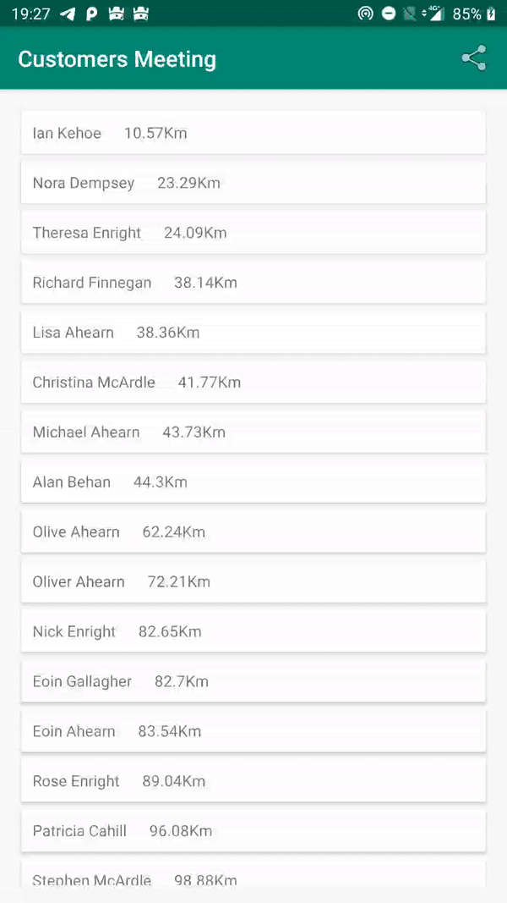

# CutumersMetting

Technical problem  We have some customer records in a text file (customers.txt) -- one customer per line, JSON lines formatted. We want to invite any customer within 100km of our Dublin office for some food and drinks on us. Write a program that will read the full list of customers and output the names and user ids of matching customers (within 100km), sorted by User ID (ascending).

[Apk Donwload](https://github.com/hlandim/CutumersMetting/raw/master/app-debug.apk)
[Output](https://github.com/hlandim/CutumersMetting/blob/master/output_example.json)

# Get output list on app

